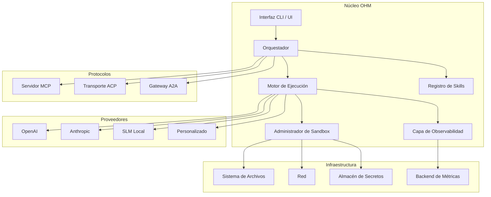
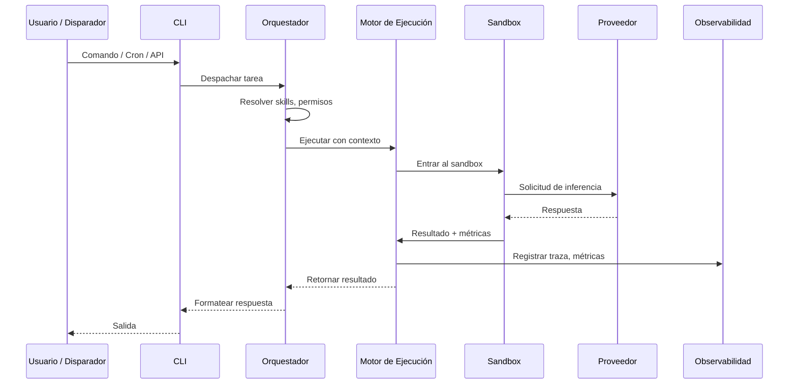

# OHM — Orquestador e Ingesta para Modelos

[](LICENSE)
[](https://www.python.org/downloads/)
[](https://docs.astral.sh/uv/)

> **Orquestador e ingesta de grado empresarial para LLMs — agnóstico de proveedor, agnóstico de SO, listo para producción.**

[English](README.md) | [Español](README.es.md)

---

## Qué es OHM

**OHM** (Orchestrator & Harness for Models) es un marco de trabajo de grado empresarial para construir, desplegar y operar agentes de IA a escala. No es solo un agente — es la **capa de infraestructura** que hace que los agentes sean confiables, observables, seguros e intercambiables.

La mayoría de los marcos de agentes tratan al LLM como el producto. OHM trata al LLM como un **componente intercambiable** dentro de un sistema más grande. Tú proporcionas tu modelo (OpenAI, Anthropic, SLM local o cualquier proveedor), y OHM provee la capa de orquestación, sandbox, observabilidad y extensibilidad alrededor de él.

**El problema que OHM resuelve:** Los equipos construyen agentes que funcionan en demostraciones pero fallan en producción — sin aislamiento, sin métricas, sin resiliencia, sin forma de cambiar de proveedor sin reescribir todo. OHM corrige esto al tratar a los agentes como **infraestructura de primera clase** con el mismo rigor que aplicamos a bases de datos, colas y APIs.

**Filosofía:**
- **Ingesta sobre agente** — OHM es el plano de control, no el cerebro
- **Agnóstico de proveedor** — tu lógica nunca debe depender de qué LLM utilizas
- **Seguridad por defecto** — el sandboxing y los límites de permisos no son opcionales
- **Observable por diseño** — si no puedes medirlo, no puedes operarlo
- **Estándares primero** — MCP, ACP, A2A no son añadidos, son la base

---

## Características Principales

### Agnóstico de Proveedor

OHM no le importa qué LLM impulsa tu agente. Intercambia entre OpenAI, Anthropic, Google, modelos locales (Ollama, llama.cpp) o proveedores personalizados sin cambiar una sola línea de lógica del agente.

- Interfaz unificada de inferencia para todos los proveedores
- Fallback automático y reintento con seguimiento de salud del proveedor
- Enrutamiento consciente de costos: usa SLMs para tareas simples, modelos frontier para tareas complejas
- Registro de modelos con metadatos de capacidades

### Agnóstico de SO — CLI, Interactivo, Headless

Ejecuta OHM en cualquier lugar, en cualquier modo:

| Modo | Caso de Uso |
|------|------------|
| **CLI Interactivo** | Estación de trabajo del desarrollador, depuración, exploración |
| **Headless / Nube** | Pipelines CI/CD, funciones serverless, procesamiento por lotes |
| **Programado (Cron)** | Tareas recurrentes, monitoreo, flujos de trabajo autónomos |
| **Biblioteca** | Incorpora OHM como dependencia en tu aplicación Python |

Misma lógica del agente, misma configuración, mismo comportamiento — ya sea en Linux, macOS, Windows o un contenedor.

### Seguridad y Sandboxing

Cada ejecución del agente se ejecuta dentro de un **entorno aislado** con límites de permisos explícitos:

- Aislamiento del sistema de archivos — los agentes solo acceden a lo que permites
- Restricciones de red — las conexiones salientes son controladas y auditables
- Políticas de ejecución de comandos — acceso a shell basado en listas de permitidos
- Límites de recursos — límites de CPU, memoria y tiempo de ejecución
- Gestión de secretos — las credenciales se inyectan, nunca se codifican
- Registro de auditoría — cada acción se registra con contexto completo

### Observabilidad y Métricas

No puedes operar lo que no puedes ver. OHM provee observabilidad de primera clase:

- **Registro estructurado** — logs JSON con IDs de correlación entre ejecuciones del agente
- **Métricas** — uso de tokens, latencia, costo, tasa de éxito, clasificación de errores
- **Trazas** — trazas de ejecución completas desde el prompt hasta la respuesta y la llamada a herramientas
- **Dashboards** — exporta a Prometheus, OpenTelemetry o backends personalizados
- **Hooks de evaluación** — mide calidad, no solo rendimiento

### Extensibilidad — Skills y Plugins

El comportamiento de OHM se define por **skills** — unidades autónomas de capacidad que se componen como bloques de construcción:

- **Skills** — instrucciones, conjuntos de herramientas y flujos de trabajo específicos del dominio
- **Comandos Personalizados** — extiende el CLI con operaciones específicas del proyecto
- **Sistema de Plugins** — agrega nuevos proveedores, herramientas, transportes o middleware
- **Personalización de UI** — adapta la interfaz interactiva al flujo de trabajo de tu equipo

Los skills son declarativos, versionables y compartibles. Instala skills de la comunidad o crea los tuyos.

### Multi-Agente y Protocolos

OHM está construido para **interoperabilidad desde el primer día**:

- **MCP (Model Context Protocol)** — interfaz estándar de herramientas/recursos para LLMs ([especificación](https://modelcontextprotocol.io/docs/getting-started/intro))
- **ACP (Agent Client Protocol)** — comunicación agente-a-cliente para sistemas multi-agente ([especificación](https://agentclientprotocol.com/get-started/introduction))
- **A2A (Agent-to-Agent)** — descubrimiento y delegación entre agentes ([especificación](https://a2a-protocol.org/latest/))
- **Orquestación multi-agente** — coordina múltiples agentes con grafos de dependencias, estado compartido y resolución de conflictos

### Resiliencia y Soporte SLM

Los sistemas de producción fallan. OHM lo espera:

- **Reintento automático** con retroceso exponencial y jitter
- **Interruptores de circuito** — deja de llamar a proveedores que están caídos
- **Degradación elegante** — recurre a SLMs cuando los modelos frontier no están disponibles
- **Soporte de worktree** — los agentes operan en git worktrees aislados para ejecución paralela segura
- **Modo SLM** — ejecuta modelos más pequeños y rápidos para tareas concretas y bien definidas (clasificación, extracción, enrutamiento) reservando los modelos frontier para razonamiento complejo

---

## Descripción de la Arquitectura

### Diagrama de Componentes



### Flujo de Ejecución



```
┌─────────────────────────────────────────────────────────┐
│              ARQUITECTURA DE OHM                         │
├─────────────────────────────────────────────────────────┤
│                                                         │
│  ┌──────────┐   ┌──────────────┐   ┌──────────────┐   │
│  │   CLI    │──▶│ Orquestador  │──▶│    Motor     │   │
│  │ / UI     │   │              │   │ de Ejecución │   │
│  └──────────┘   └──────┬───────┘   └──────┬───────┘   │
│                        │                   │            │
│               ┌────────▼───────┐   ┌───────▼────────┐  │
│               │  Registro de   │   │ Administrador  │  │
│               │    Skills      │   │   de Sandbox   │  │
│               └────────────────┘   └───────┬────────┘  │
│                                            │            │
│                              ┌─────────────┼────────┐  │
│                              │             │        │  │
│                         ┌────▼───┐  ┌──────▼──┐ ┌──▼─┐│
│                         │Provee- │  │ Restric-│ │Aisl││
│                         │dores   │  │ ciones  │ │ FS ││
│                         │OpenAI  │  │  Red    │ │    ││
│                         │Anthropic│  └─────────┘ └────┘│
│                         │SLM/Local│                     │
│                         └─────────┘                     │
│                                                         │
│  ┌──────────────────────────────────────────────────┐  │
│  │          Capa de Observabilidad                    │  │
│  │  Logs │ Métricas │ Trazas │ Hooks de Evaluación   │  │
│  └──────────────────────────────────────────────────┘  │
│                                                         │
│  ┌──────────────────────────────────────────────────┐  │
│  │        Adaptadores de Protocolo                   │  │
│  │  MCP │ ACP │ A2A                                  │  │
│  └──────────────────────────────────────────────────┘  │
└─────────────────────────────────────────────────────────┘
```

---

## Stack Tecnológico

### Actual

| Componente | Tecnología | Propósito |
|-----------|-----------|-----------|
| Lenguaje | Python 3.12+ | Runtime principal |
| Gestor de Paquetes | [UV](https://docs.astral.sh/uv/) | Empaquetado Python rápido y confiable |
| Linter/Formateador | [Ruff](https://docs.astral.sh/ruff/) | Control de calidad del código |
| Marco de Agentes | [Strands Agents](https://strandsagents.com/) | Runtime base del agente e integración de herramientas |

### Hoja de Ruta

| Componente | Objetivo | Propósito |
|-----------|---------|-----------|
| Sandbox | gVisor / nsjail / Docker | Aislamiento de procesos para ejecución del agente |
| Observabilidad | OpenTelemetry | Trazas y métricas estandarizadas |
| Protocolos | MCP, ACP, A2A | Interoperabilidad con el ecosistema de agentes |
| Almacenamiento | SQLite / PostgreSQL | Estado persistente, memoria, historial de sesiones |
| Programador | Motor cron incorporado | Ejecución programada autónoma |
| UI | Terminal UI (TUI) | Experiencia interactiva para desarrolladores |
| Secretos | HashiCorp Vault / Keyring del SO | Gestión segura de credenciales |

---

## Protocolos

OHM implementa protocolos estándar de la industria para interoperabilidad:

### MCP — Model Context Protocol

La interfaz estándar para exponer herramientas y recursos a LLMs.

```bash
# OHM se ejecuta como servidor MCP
ohm serve --protocol mcp --port 3000
```

- [Especificación MCP](https://modelcontextprotocol.io/docs/getting-started/intro)
- Registro de herramientas, descubrimiento de recursos y gestión de prompts

### ACP — Agent Client Protocol

Comunicación agente-a-cliente para sistemas multi-agente.

```bash
# Registra OHM como agente ACP
ohm register --protocol acp --endpoint https://tu-registro.com
```

- [Especificación ACP](https://agentclientprotocol.com/get-started/introduction)

### A2A — Agent-to-Agent Protocol

Descubrimiento, delegación y colaboración entre agentes.

```bash
# Habilita el gateway A2A
ohm gateway --protocol a2a --listen 0.0.0.0:8080
```

- [Especificación A2A](https://a2a-protocol.org/latest/)

---

## Inicio Rápido

### Prerrequisitos

- Python 3.12+
- Gestor de paquetes [UV](https://docs.astral.sh/uv/)

### Instalación

```bash
# Clona el repositorio
git clone https://github.com/tu-org/ohm.git
cd ohm

# Instala dependencias
uv sync

# Verifica la instalación
ohm --version
```

### Configuración

```bash
# Inicializa OHM en tu proyecto
ohm init

# Configura tu proveedor
ohm config set provider.openai.api_key $OPENAI_API_KEY

# O usa un modelo local
ohm config set provider.local.endpoint http://localhost:11434
```

### Primera Ejecución

```bash
# Modo interactivo
ohm run --interactive

# Tarea única (headless)
ohm run "Resume el archivo main.py"

# Con modelo específico
ohm run --model anthropic/claude-sonnet-4-20250514 "Explica la arquitectura"
```

---

## Modos de Uso

### CLI Interactivo

Interfaz de terminal completa para desarrollo y exploración:

```bash
ohm                    # Inicia sesión interactiva
ohm --verbose          # Con salida detallada
ohm --sandbox strict   # Con sandbox estricto
```

### Ejecución Headless / Nube

Modo no interactivo para automatización y despliegue en nube:

```bash
# Entrada por pipe
echo "Corrige el bug en auth.py" | ohm run --headless

# Ejecución en Docker
docker run -e OHM_API_KEY=$KEY tu-org/ohm run "Despliega a staging"

# Integración CI/CD
ohm run --headless --config .ohm/ci.yaml "Ejecuta pruebas y reporta"
```

### Ejecución Programada (Cron)

Tareas recurrentes autónomas:

```bash
# Registra una tarea programada
ohm schedule add "auditoria-diaria" --cron "0 2 * * *" --task "Audita logs de seguridad"

# Lista tareas programadas
ohm schedule list

# Ejecuta el daemon del programador
ohm scheduler --daemon
```

### Uso como Biblioteca

Incorpora OHM en tu aplicación Python:

```python
from ohm import Orchestrator

orch = Orchestrator.from_config("ohm.yaml")
result = await orch.run("Analiza este código fuente", model="anthropic/claude-sonnet-4-20250514")
print(result.output)
```

---

## Modelo de Seguridad

### Arquitectura de Sandbox

Cada ejecución del agente está aislada:

```
┌─────────────────────────────────────┐
│          Sistema Anfitrión          │
│  ┌───────────────────────────────┐  │
│  │        Sandbox de OHM         │  │
│  │  ┌─────────┐  ┌───────────┐  │  │
│  │  │ Proceso │  │Sistema de │  │  │
│  │  │  Agente │  │Archivos   │  │  │
│  │  │         │  │(aislado)  │  │  │
│  │  └────┬────┘  └───────────┘  │  │
│  │       │                       │  │
│  │  ┌────▼────────────────────┐  │  │
│  │  │ Límite de Permisos      │  │  │
│  │  │  - Acceso a archivos    │  │  │
│  │  │  - Red (lista permit.)  │  │  │
│  │  │  - Comandos (lista per.)│  │  │
│  │  │  - Recursos (límites)   │  │  │
│  │  └─────────────────────────┘  │  │
│  └───────────────────────────────┘  │
└─────────────────────────────────────┘
```

### Sistema de Permisos

```yaml
# ohm.permissions.yaml
sandbox:
  filesystem:
    read: ["/proyecto/**"]
    write: ["/proyecto/salida/**"]
  network:
    allow: ["api.openai.com", "api.anthropic.com"]
    deny: ["*"]
  commands:
    allow: ["git", "pytest", "ruff"]
    deny: ["rm", "curl", "wget"]
  resources:
    max_memory: "512MB"
    max_cpu: "2 cores"
    max_duration: "300s"
```

---

## Observabilidad

### Recolección de Métricas

OHM emite métricas estructuradas en cada operación:

```
ohm.metrics.tokens.input     {model="gpt-4", provider="openai"} 1247
ohm.metrics.tokens.output    {model="gpt-4", provider="openai"} 892
ohm.metrics.latency.ms       {model="gpt-4", provider="openai"} 2340
ohm.metrics.cost.usd         {model="gpt-4", provider="openai"} 0.089
ohm.metrics.runs.success     {model="gpt-4", provider="openai"} 1
```

### Trazas

Trazas de ejecución completas con IDs de correlación:

```
[traza-abc123] Tarea recibida: "Corregir bug de autenticación"
[traza-abc123] Skills resueltos: [python-debugger, git-ops]
[traza-abc123] Sandbox creado: modo-estricto
[traza-abc123] Proveedor seleccionado: anthropic/claude-sonnet-4-20250514
[traza-abc123] Inferencia completada: 1247 tokens en 2340ms
[traza-abc123] Llamada a herramienta: git diff → 34 líneas
[traza-abc123] Llamada a herramienta: edit src/auth.py → éxito
[traza-abc123] Tarea completada: éxito en 8.2s
```

### Exportación

```bash
# Exporta a OpenTelemetry
ohm observe --export otel --endpoint http://localhost:4317

# Exporta a Prometheus
ohm observe --export prometheus --port 9090

# Análisis local
ohm observe --export json --output trazas.jsonl
```

---

## Extensibilidad

### Sistema de Skills

Los skills son módulos de capacidad autónomos:

```
skills/
├── python-debugger/
│   ├── SKILL.md          # Definición e instrucciones del skill
│   ├── tools.yaml        # Configuraciones de herramientas
│   └── prompts/          # Plantillas de prompts
├── git-ops/
│   ├── SKILL.md
│   └── tools.yaml
└── security-audit/
    ├── SKILL.md
    ├── tools.yaml
    └── rules/
```

```bash
# Instala un skill
ohm skill install ./skills/python-debugger

# Lista skills activos
ohm skill list

# Ejecuta con skills específicos
ohm run --skills python-debugger,git-ops "Corrige la prueba que falla"
```

### Comandos Personalizados

Extiende el CLI con operaciones específicas del proyecto:

```yaml
# .ohm/commands.yaml
commands:
  deploy:
    description: "Despliega a producción"
    task: "Ejecuta la lista de verificación de despliegue y despliega a staging"
    skills: [git-ops, deploy-tools]
  review:
    description: "Revisa PRs pendientes"
    task: "Revisa PRs abiertos por calidad de código y seguridad"
    skills: [code-review, security-audit]
```

```bash
ohm deploy          # Comando personalizado
ohm review          # Otro comando personalizado
```

### Personalización de UI

```yaml
# .ohm/ui.yaml
interface:
  theme: dark
  prompt: "❯ "
  response_format: markdown
  show_tokens: true
  show_cost: true
  history_size: 1000
```

---

## Hoja de Ruta

### Fase 1 — Fundación ✅
- [x] Andamiaje del proyecto con Python 3.12+, UV, Ruff
- [x] Integración de Strands Agents
- [x] Interfaz CLI básica
- [x] Capa de abstracción de proveedores

### Fase 2 — Motor Core 🔄
- [ ] Administrador de sandbox (gVisor / Docker)
- [ ] Registro y cargador de skills (en progreso)
- [x] Registro estructurado y métricas
- [ ] Implementación del servidor MCP

### Fase 3 — Interoperabilidad
- [ ] Adaptador de transporte ACP
- [ ] Gateway A2A
- [ ] Orquestación multi-agente
- [ ] Soporte de git worktree

### Fase 4 — Producción
- [ ] Ejecución programada (motor cron)
- [ ] Integración de gestión de secretos
- [ ] Dashboard y UI de monitoreo
- [ ] Enrutamiento SLM y optimización de costos

### Fase 5 — Ecosistema
- [ ] Marketplace de skills
- [ ] Plugins de la comunidad
- [ ] Características empresariales (RBAC, auditoría, cumplimiento)
- [ ] Soporte multi-tenant

---

## Contribuir

Consulta [CONTRIBUTING.md](CONTRIBUTING.md) para las directrices.

### Configuración del Desarrollo

```bash
# Clona e instala
git clone https://github.com/tu-org/ohm.git
cd ohm
uv sync

# Ejecuta pruebas
uv run pytest

# Lint
uv run ruff check .
uvrun ruff format .
```

### Documentación e Integración

- [Guía de Integración Engram & Gentle-AI](docs/engram-gentle-ai-integration.md)
- Las decisiones de diseño significativas están documentadas en [docs/adr/](docs/adr/).

---

## Licencia

Licenciado bajo la [Licencia Apache, Versión 2.0](LICENSE).

```
Copyright 2026 Contribuidores de OHM

Licenciado bajo la Licencia Apache, Versión 2.0 (la "Licencia");
no puedes usar este archivo excepto en cumplimiento con la Licencia.
Puedes obtener una copia de la Licencia en

    http://www.apache.org/licenses/LICENSE-2.0

A menos que lo requiera la ley aplicable o se acuerde por escrito, el
software distribuido bajo la Licencia se distribuye "TAL CUAL",
SIN GARANTÍAS O CONDICIONES DE NINGÚN TIPO, ya sea expresa o implícita.
Consulta la Licencia para el idioma específico que rige los permisos y
limitaciones bajo la Licencia.
```
