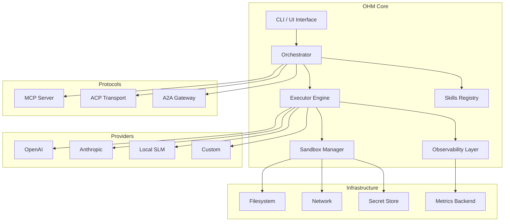
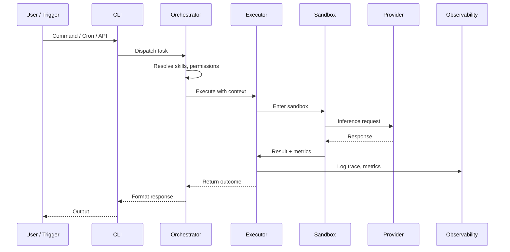

# OHM — Orchestrator & Harness for Models

[](LICENSE)
[](https://www.python.org/downloads/)
[](https://docs.astral.sh/uv/)

> **Enterprise-grade orchestrator and harness for LLMs — provider-agnostic, OS-agnostic, production-ready.**

[English](README.md) | [Español](README.es.md)

---

## What is OHM

**OHM** (Orchestrator & Harness for Models) is an enterprise-grade framework for building, deploying, and operating AI agents at scale. It is not just an agent — it is the **infrastructure layer** that makes agents reliable, observable, secure, and interchangeable.

Most agent frameworks treat the LLM as the product. OHM treats the LLM as a **pluggable component** inside a larger system. You bring your model (OpenAI, Anthropic, local SLM, or any provider), and OHM provides the orchestration, sandboxing, observability, and extensibility layer around it.

**The problem OHM solves:** Teams build agents that work in demos but break in production — no isolation, no metrics, no resilience, no way to swap providers without rewriting everything. OHM fixes this by treating agents as **first-class infrastructure** with the same rigor we apply to databases, queues, and APIs.

**Philosophy:**
- **Harness over agent** — OHM is the control plane, not the brain
- **Provider-agnostic** — your logic should never depend on which LLM you use
- **Security by default** — sandboxing and permission boundaries are not optional
- **Observable by design** — if you can't measure it, you can't operate it
- **Standards-first** — MCP, ACP, A2A are not afterthoughts, they are the foundation

---

## Key Features

### Provider Agnostic

OHM does not care which LLM powers your agent. Swap between OpenAI, Anthropic, Google, local models (Ollama, llama.cpp), or custom providers without changing a single line of agent logic.

- Unified inference interface across all providers
- Automatic fallback and retry with provider health tracking
- Cost-aware routing: use SLMs for simple tasks, frontier models for complex ones
- Model registry with capability metadata

### OS Agnostic — CLI, Interactive, Headless

Run OHM anywhere, in any mode:

| Mode | Use Case |
|------|----------|
| **Interactive CLI** | Developer workstation, debugging, exploration |
| **Headless / Cloud** | CI/CD pipelines, serverless functions, batch processing |
| **Scheduled (Cron)** | Recurring tasks, monitoring, autonomous workflows |
| **Library** | Embed OHM as a dependency in your Python application |

Same agent logic, same configuration, same behavior — whether you're on Linux, macOS, Windows, or a container.

### Security & Sandboxing

Every agent execution runs inside a **sandboxed environment** with explicit permission boundaries:

- Filesystem isolation — agents only access what you allow
- Network restrictions — outbound connections are controlled and auditable
- Command execution policies — allowlist-based shell access
- Resource limits — CPU, memory, and execution time caps
- Secret management — credentials are injected, never hardcoded
- Audit trail — every action is logged with full context

### Observability & Metrics

You cannot operate what you cannot see. OHM provides first-class observability:

- **Structured logging** — JSON logs with correlation IDs across agent runs
- **Metrics** — token usage, latency, cost, success rate, error classification
- **Tracing** — full execution traces from prompt to response to tool call
- **Dashboards** — export to Prometheus, OpenTelemetry, or custom backends
- **Eval hooks** — measure quality, not just throughput

### Extensibility — Skills & Plugins

OHM's behavior is defined by **skills** — self-contained units of capability that compose like building blocks:

- **Skills** — domain-specific instructions, tool sets, and workflows
- **Custom Commands** — extend the CLI with project-specific operations
- **Plugin System** — add new providers, tools, transports, or middleware
- **UI Customization** — adapt the interactive interface to your team's workflow

Skills are declarative, versionable, and shareable. Install community skills or write your own.

### Multi-Agent & Protocols

OHM is built for **interoperability from day one**:

- **MCP (Model Context Protocol)** — standard tool/resource interface for LLMs ([spec](https://modelcontextprotocol.io/docs/getting-started/intro))
- **ACP (Agent Client Protocol)** — agent-to-client communication ([spec](https://agentclientprotocol.com/get-started/introduction))
- **A2A (Agent-to-Agent)** — inter-agent discovery and delegation ([spec](https://a2a-protocol.org/latest/))
- **Multi-agent orchestration** — coordinate multiple agents with dependency graphs, shared state, and conflict resolution

### Resilience & SLM Support

Production systems fail. OHM expects it:

- **Automatic retry** with exponential backoff and jitter
- **Circuit breakers** — stop calling providers that are down
- **Graceful degradation** — fall back to SLMs when frontier models are unavailable
- **Worktree support** — agents operate on isolated git worktrees for safe parallel execution
- **SLM mode** — run smaller, faster models for concrete, well-defined tasks (classification, extraction, routing) while reserving frontier models for complex reasoning

---

## Architecture Overview

### Component Diagram



### Execution Flow



```
┌─────────────────────────────────────────────────────────┐
│                      OHM ARCHITECTURE                    │
├─────────────────────────────────────────────────────────┤
│                                                         │
│  ┌──────────┐   ┌──────────────┐   ┌──────────────┐   │
│  │   CLI    │──▶│ Orchestrator │──▶│   Executor   │   │
│  │ / UI     │   │              │   │   Engine     │   │
│  └──────────┘   └──────┬───────┘   └──────┬───────┘   │
│                        │                   │            │
│               ┌────────▼───────┐   ┌───────▼────────┐  │
│               │ Skills Registry│   │ Sandbox Manager │  │
│               └────────────────┘   └───────┬────────┘  │
│                                            │            │
│                              ┌─────────────┼────────┐  │
│                              │             │        │  │
│                         ┌────▼───┐  ┌──────▼──┐ ┌──▼─┐│
│                         │Providers│  │Network  │ │FS  ││
│                         │OpenAI   │  │Restrict │ │Isol││
│                         │Anthropic│  └─────────┘ └────┘│
│                         │SLM/Local│                     │
│                         └─────────┘                     │
│                                                         │
│  ┌──────────────────────────────────────────────────┐  │
│  │              Observability Layer                   │  │
│  │  Logs │ Metrics │ Traces │ Eval Hooks             │  │
│  └──────────────────────────────────────────────────┘  │
│                                                         │
│  ┌──────────────────────────────────────────────────┐  │
│  │              Protocol Adapters                    │  │
│  │  MCP │ ACP │ A2A                                  │  │
│  └──────────────────────────────────────────────────┘  │
└─────────────────────────────────────────────────────────┘
```

---

## Tech Stack

### Current

| Component | Technology | Purpose |
|-----------|-----------|---------|
| Language | Python 3.12+ | Core runtime |
| Package Manager | [UV](https://docs.astral.sh/uv/) | Fast, reliable Python packaging |
| Linter/Formatter | [Ruff](https://docs.astral.sh/ruff/) | Code quality enforcement |
| Agent Framework | [Strands Agents](https://strandsagents.com/) | Base agent runtime and tool integration |

### Roadmap

| Component | Target | Purpose |
|-----------|--------|---------|
| Sandbox | gVisor / nsjail / Docker | Process isolation for agent execution |
| Observability | OpenTelemetry | Standardized tracing and metrics |
| Protocol | MCP, ACP, A2A | Interoperability with the agent ecosystem |
| Storage | SQLite / PostgreSQL | Persistent state, memory, session history |
| Scheduler | Built-in cron engine | Autonomous scheduled execution |
| UI | Terminal UI (TUI) | Interactive developer experience |
| Secrets | HashiCorp Vault / OS keyring | Secure credential management |

---

## Protocols

OHM implements industry-standard protocols for interoperability:

### MCP — Model Context Protocol

The standard interface for exposing tools and resources to LLMs.

```bash
# OHM runs as an MCP server
ohm serve --protocol mcp --port 3000
```

- [MCP Specification](https://modelcontextprotocol.io/docs/getting-started/intro)
- Tool registration, resource discovery, and prompt management

### ACP — Agent Client Protocol

Agent-to-client communication for multi-agent systems.

```bash
# Register OHM as an ACP agent
ohm register --protocol acp --endpoint https://your-registry.com
```

- [ACP Specification](https://agentclientprotocol.com/get-started/introduction)

### A2A — Agent-to-Agent Protocol

Inter-agent discovery, delegation, and collaboration.

```bash
# Enable A2A gateway
ohm gateway --protocol a2a --listen 0.0.0.0:8080
```

- [A2A Specification](https://a2a-protocol.org/latest/)

---

## Quick Start

### Prerequisites

- Python 3.12+
- [UV](https://docs.astral.sh/uv/) package manager

### Installation

```bash
# Clone the repository
git clone https://github.com/SinDeployNoHayPizza/ohm.git
cd ohm

# Install dependencies
uv sync

# Verify installation
ohm --version
```

### Configuration

```bash
# Initialize OHM in your project
ohm init

# Configure your provider
ohm config set provider.openai.api_key $OPENAI_API_KEY

# Or use a local model
ohm config set provider.local.endpoint http://localhost:11434
```

### First Run

```bash
# Interactive mode
ohm run --interactive

# Single task (headless)
ohm run "Summarize the main.py file"

# With specific model
ohm run --model anthropic/claude-sonnet-4-20250514 "Explain the architecture"
```

---

## Usage Modes

### Interactive CLI

Full-featured terminal interface for development and exploration:

```bash
ohm                    # Launch interactive session
ohm --verbose          # With detailed output
ohm --sandbox strict   # With strict sandboxing
```

### Headless / Cloud Execution

Non-interactive mode for automation and cloud deployment:

```bash
# Pipe input
echo "Fix the bug in auth.py" | ohm run --headless

# Docker execution
docker run -e OHM_API_KEY=$KEY SinDeployNoHayPizza/ohm run "Deploy to staging"

# CI/CD integration
ohm run --headless --config .ohm/ci.yaml "Run tests and report"
```

### Scheduled Execution (Cron)

Autonomous recurring tasks:

```bash
# Register a scheduled task
ohm schedule add "daily-audit" --cron "0 2 * * *" --task "Audit security logs"

# List scheduled tasks
ohm schedule list

# Run scheduler daemon
ohm scheduler --daemon
```

### Library Usage

Embed OHM in your Python application:

```python
from ohm import Orchestrator

orch = Orchestrator.from_config("ohm.yaml")
result = await orch.run("Analyze this codebase", model="anthropic/claude-sonnet-4-20250514")
print(result.output)
```

---

## Security Model

### Sandbox Architecture

Every agent execution is isolated:

```
┌─────────────────────────────────────┐
│           Host System               │
│  ┌───────────────────────────────┐  │
│  │        OHM Sandbox            │  │
│  │  ┌─────────┐  ┌───────────┐  │  │
│  │  │ Agent   │  │ Filesystem │  │  │
│  │  │ Process │  │ (isolated) │  │  │
│  │  └────┬────┘  └───────────┘  │  │
│  │       │                       │  │
│  │  ┌────▼────────────────────┐  │  │
│  │  │   Permission Boundary   │  │  │
│  │  │  - File access (R/W)    │  │  │
│  │  │  - Network (allowlist)  │  │  │
│  │  │  - Commands (allowlist) │  │  │
│  │  │  - Resources (limits)   │  │  │
│  │  └─────────────────────────┘  │  │
│  └───────────────────────────────┘  │
└─────────────────────────────────────┘
```

### Permission System

```yaml
# ohm.permissions.yaml
sandbox:
  filesystem:
    read: ["/project/**"]
    write: ["/project/output/**"]
  network:
    allow: ["api.openai.com", "api.anthropic.com"]
    deny: ["*"]
  commands:
    allow: ["git", "pytest", "ruff"]
    deny: ["rm", "curl", "wget"]
  resources:
    max_memory: "512MB"
    max_cpu: "2 cores"
    max_duration: "300s"
```

---

## Observability

### Metrics Collection

OHM emits structured metrics on every operation:

```
ohm.metrics.tokens.input     {model="gpt-4", provider="openai"} 1247
ohm.metrics.tokens.output    {model="gpt-4", provider="openai"} 892
ohm.metrics.latency.ms       {model="gpt-4", provider="openai"} 2340
ohm.metrics.cost.usd         {model="gpt-4", provider="openai"} 0.089
ohm.metrics.success           {model="gpt-4", provider="openai"} 1
```

### Tracing

Full execution traces with correlation IDs:

```
[trace-abc123] Task received: "Fix auth bug"
[trace-abc123] Skills resolved: [python-debugger, git-ops]
[trace-abc123] Sandbox created: strict-mode
[trace-abc123] Provider selected: anthropic/claude-sonnet-4-20250514
[trace-abc123] Inference completed: 1247 tokens in 2340ms
[trace-abc123] Tool call: git diff → 34 lines
[trace-abc123] Tool call: edit src/auth.py → success
[trace-abc123] Task completed: success in 8.2s
```

### Export

```bash
# Export to OpenTelemetry
ohm observe --export otel --endpoint http://localhost:4317

# Export to Prometheus
ohm observe --export prometheus --port 9090

# Local analysis
ohm observe --export json --output traces.jsonl
```

---

## Extensibility

### Skills System

Skills are self-contained capability modules:

```
skills/
├── python-debugger/
│   ├── SKILL.md          # Skill definition and instructions
│   ├── tools.yaml        # Tool configurations
│   └── prompts/          # Prompt templates
├── git-ops/
│   ├── SKILL.md
│   └── tools.yaml
└── security-audit/
    ├── SKILL.md
    ├── tools.yaml
    └── rules/
```

```bash
# Install a skill
ohm skill install ./skills/python-debugger

# List active skills
ohm skill list

# Run with specific skills
ohm run --skills python-debugger,git-ops "Fix the failing test"
```

### Custom Commands

Extend the CLI with project-specific operations:

```yaml
# .ohm/commands.yaml
commands:
  deploy:
    description: "Deploy to production"
    task: "Run deployment checklist and deploy to staging"
    skills: [git-ops, deploy-tools]
  review:
    description: "Review pending PRs"
    task: "Review open PRs for code quality and security"
    skills: [code-review, security-audit]
```

```bash
ohm deploy          # Custom command
ohm review          # Another custom command
```

### UI Customization

```yaml
# .ohm/ui.yaml
interface:
  theme: dark
  prompt: "❯ "
  response_format: markdown
  show_tokens: true
  show_cost: true
  history_size: 1000
```

---

## Roadmap

### Phase 1 — Foundation ✅
- [x] Project scaffold with Python 3.12+, UV, Ruff
- [x] Strands Agents integration
- [ ] Basic CLI interface
- [ ] Provider abstraction layer

### Phase 2 — Core Engine
- [ ] Sandbox manager (gVisor / Docker)
- [ ] Skills registry and loader
- [ ] Structured logging and metrics
- [ ] MCP server implementation

### Phase 3 — Interoperability
- [ ] ACP transport adapter
- [ ] A2A gateway
- [ ] Multi-agent orchestration
- [ ] Git worktree support

### Phase 4 — Production
- [ ] Scheduled execution (cron engine)
- [ ] Secret management integration
- [ ] Dashboard and monitoring UI
- [ ] SLM routing and cost optimization

### Phase 5 — Ecosystem
- [ ] Skill marketplace
- [ ] Community plugins
- [ ] Enterprise features (RBAC, audit, compliance)
- [ ] Multi-tenant support

---

## Contributing

See [CONTRIBUTING.md](CONTRIBUTING.md) for guidelines.

### Development Setup

```bash
# Clone and install
git clone https://github.com/SinDeployNoHayPizza/ohm.git
cd ohm
uv sync

# Run tests
uv run pytest

# Lint
uv run ruff check .
uv run ruff format .
```

### Architecture Decisions

Significant design decisions are documented in [docs/adr/](docs/adr/).

---

## License

Licensed under the [Apache License, Version 2.0](LICENSE).

```
Copyright 2026 OHM Contributors

Licensed under the Apache License, Version 2.0 (the "License");
you may not use this file except in compliance with the License.
You may obtain a copy of the License at

    http://www.apache.org/licenses/LICENSE-2.0

Unless required by applicable law or agreed to in writing, software
distributed under the License is distributed on an "AS IS" BASIS,
WITHOUT WARRANTIES OR CONDITIONS OF ANY KIND, either express or implied.
See the License for the specific language governing permissions and
limitations under the License.
```
